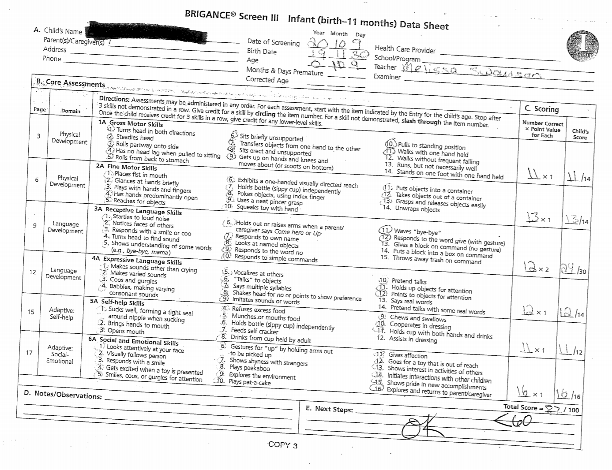
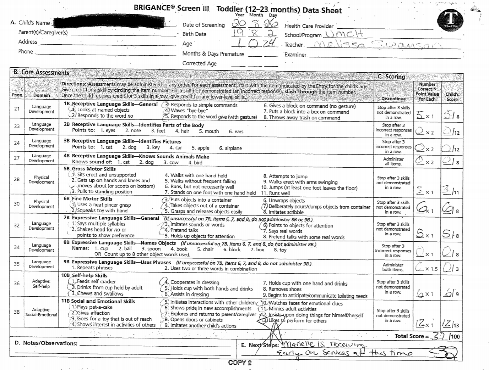
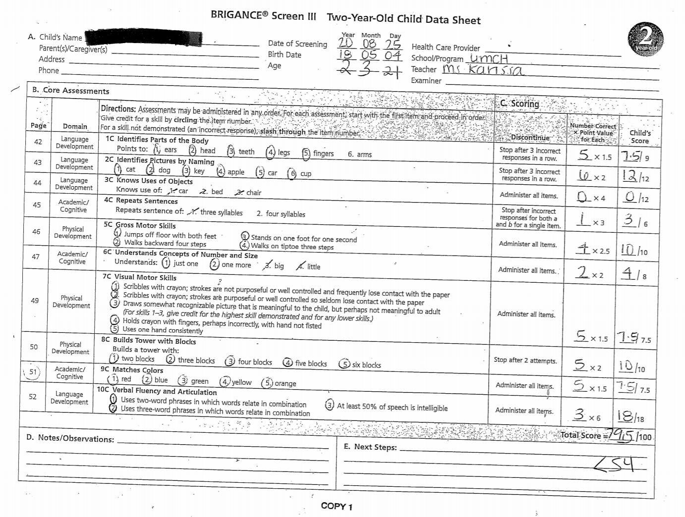
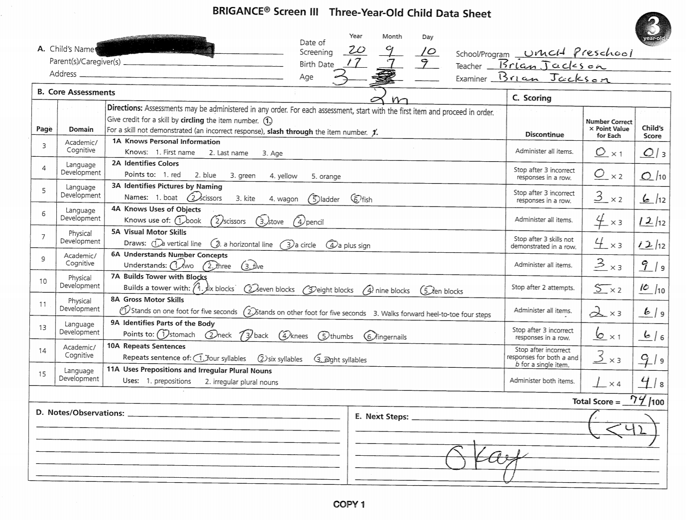
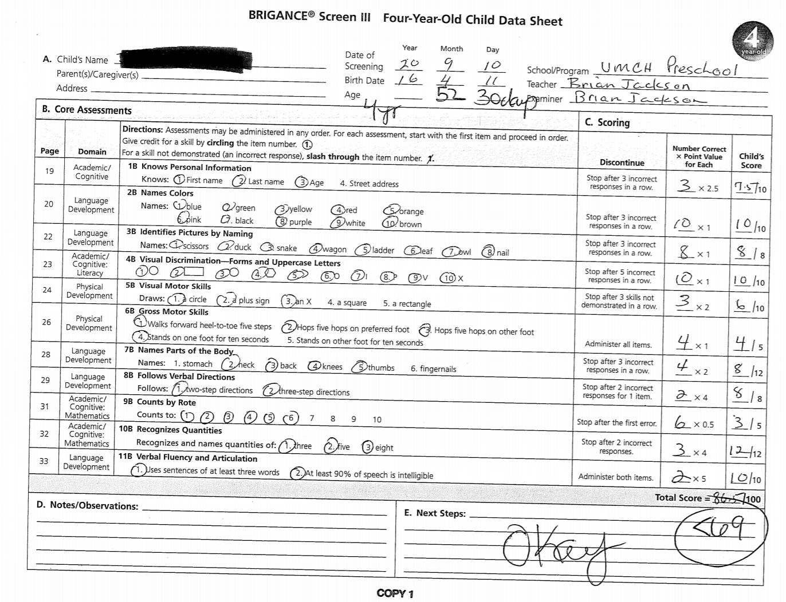
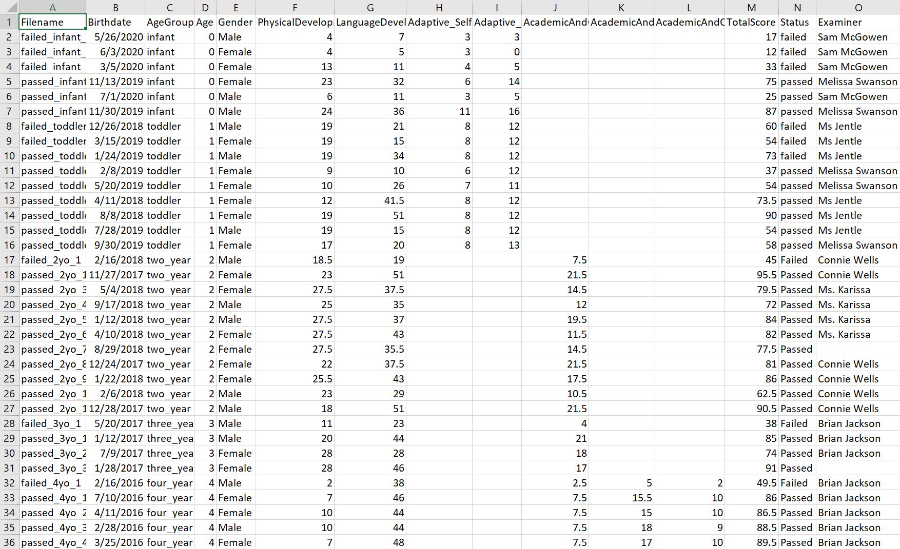
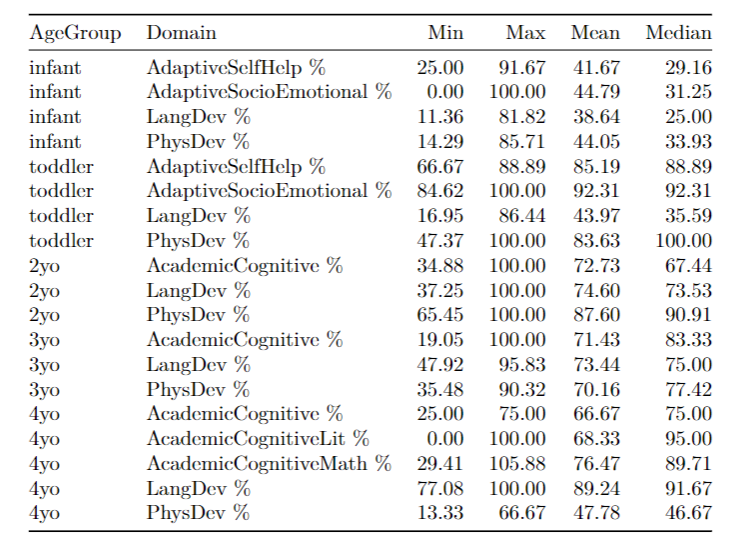
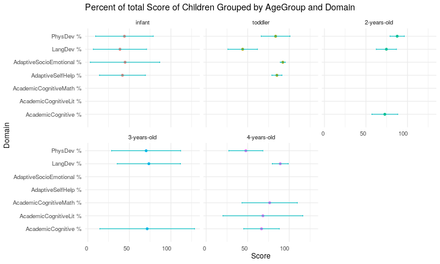
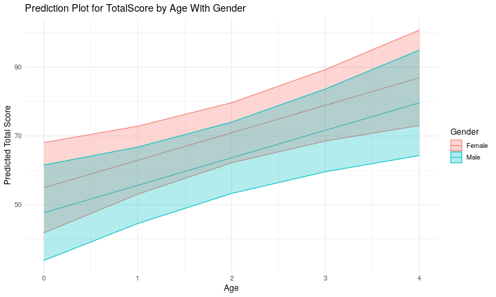

<body style="font-family: Tahoma; background-color: #7C91C3; color:white;">

```{r setup, include=FALSE}
knitr::opts_chunk$set(echo = FALSE)
```

## UMCH {.bigger}

```{r umch, out.width = '60%'}

```

>> The UMCH mission is to increase the ability of children, youth, adults and families to succeed in a diverse community. 

- Children Development Center
- Senior Programming
- Youth Programming


## Our Partner {.bigger}

```{r michelle, out.width = '20%'}

```

Michelle A. Cossar  
Director of Child Programs

## Children Development Center {.bigger}

– Full / Part-Time Child care  
– Low child-teachers ratios  
– Healthy meals and snacks  
– High Scope Curriculum  
– Brigance and COR Advantage Developmental Screenings  
– Gym activities  
– Outdoor experiences  
– Family engagement activities  
– Mindfulness Approach for Self and Classroom Management  

## Goals {.bigger}

- Which domain in the area of development is scored the lowest for each age group?  
- Which domain in the area of development is scored the highest for each age group?  
- Which domain in the area of development is scored the highest and the lowest overall?  
- Do Age and Gender have effect on Brigrance test result of a child?  

## Data: Infant

```{r infant, out.width = '70%'}

```

## Data: Toddler

```{r toddler, out.width = '70%'}

```

## Data: Two years old

```{r 2, out.width = '70%'}

```

## Data: Three years old

```{r 3, out.width = '70%'}

```

## Data: Four years old

```{r 4, out.width = '70%'}

```

## Data: Excel

```{r excel, out.width = '85%'}

```

## Data: Statistics

```{r stat, out.width = '60%'}

```

## Model {.bigger}
Response variable: TotalScore  
Predictor(s): Age, Gender   
Regression model: Linear regression 

mod_total <- lm(TotalScore ~ Age + Gender,  
          data = UMCH.clean)  
summary(mod_total)  

## Conclusions from Model
```{r model graph}

```

```{r predictions}

```


## Experience

What was the experience of working with your group/partner like? What were strengths and weaknesses, joys or challenges? What would you recommend/not to future groups; what lessons are learned? Can you suggest structural changes to the class/projects that could help?


## Perspective

What would you love to do if you got to keep working on this dataset? What mysteries remain, or what additional data would be enlightening? Do you think your results will aid and inform your partner’s work going forward? How so?

Notes for perspective:

"If a larger dataset was available, it would be possible to get estimates with less uncertainty and it would be possible to confirm or refute whether there is an overall score difference by gender.  
It would be interesting to have multiple datapoints for individual child over time, so that we could be able to account for individual differences and perhaps model how scores evolve over time. There are many ways to improve this data analysis and one would be adding more factors such as characteristics of the children, classrooms, socio-economic status, or other demographics like race and ethnicity. With more data, there are definitely more ways to go, more data to explore, more predictions to make, and more conclusion to write."

</body>
